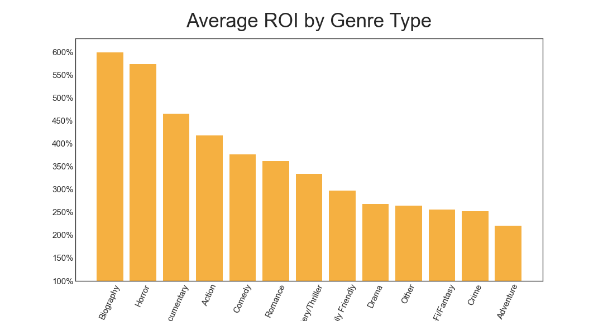
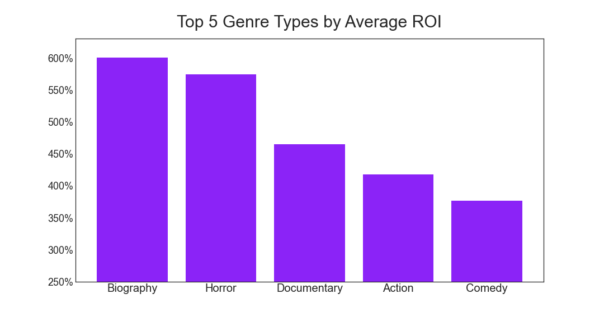
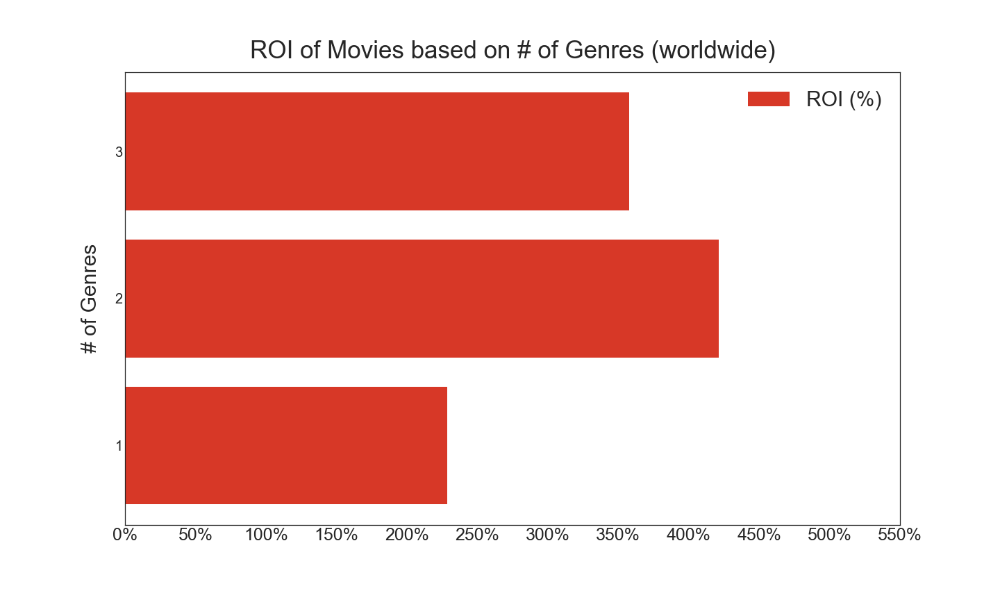
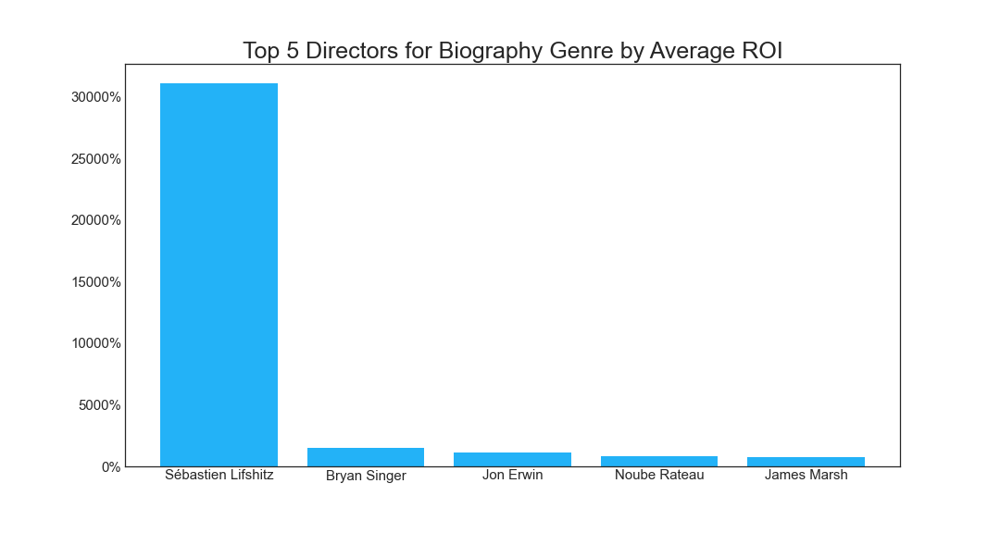
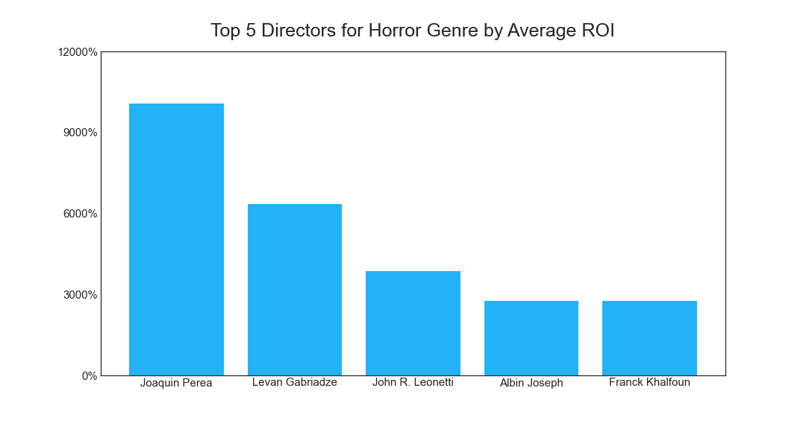
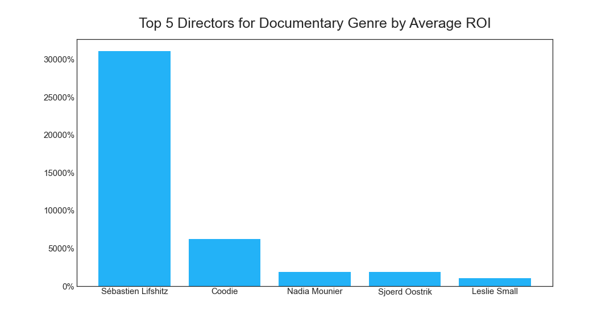
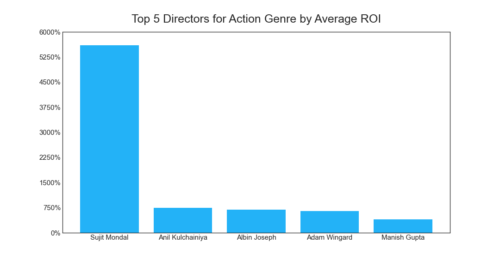
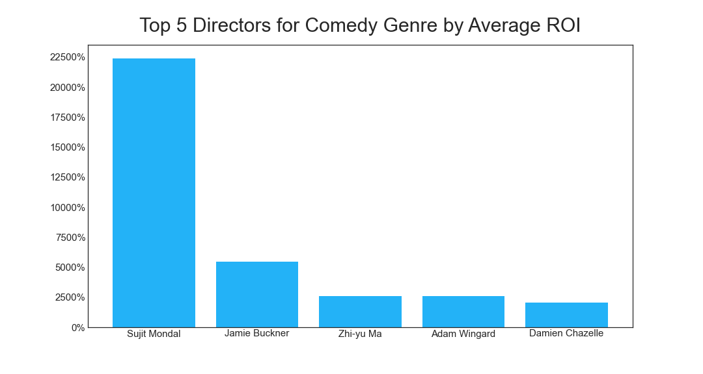

# Microsoft Studio Movie Analysis

## How To Navigate Through the Repo

In the Movie Project Analysis folder, there is a zippedData folder and a working_code folder. In the zippedData folder, is the location of the data we used for our analysis. In the working_code folder, is the code we used in our analysis. The student.ipynb file is the final product-- code, data, and markdown. The chart_pics folder contains the pictures of our charts created and saved from our code.

## Overview

This project analyzes the data from IMDB and The Numbers. The IMDB data consisted of general information such as the movie titles, release dates, actor and director information, etc. The Numbers data consisted of budgets and gross earnings. Microsoft Studios can use this data to discover the most profitable way to enter into the film industry.

## Business Problem

Microsoft Studios desires to enter into the film industry with the most optimal roadplan possible. This movie data analysis' aim is to provide Microsoft Studios with conclusions to their relevant questions.

## Data Understanding

The IMDB database has unique IDs for each movie and persons associated with the film projects. The Numbers database has each project budget and gross revenue for both domestic and worldwide. We merged the data and calcuate the Return on Investment (ROI) to display the director, genre, financial details. The data loaded below is saved as Pandas Dataframes in which analysis was conducted on.

## Methods

This project uses descriptive analysis, including analysis of movie genres with ROI and directors by genre with higher ROI. This provides a insightful overview of the film industry for Mircosoft's new movie studio to identify the desired movie types with director recommendation.

## Results

Top 5 highest ROI movie genres are Biography, Horror, Documentary, Action and Comedy. Their average ROI is over 350+%, and Biography and Horror genres stand out among the top 5 with 550+% ROI.

Also a mix of 2 genres appears to be a key indicator for higher ROI. Their average is about 60% higher than the other number of genres mixed in a movie.

These are the lineups of high ROI producing directors for respective genres.

## Conclusions

This analysis leads to the below recommendations for Microsoft's new studio:

Highly recommend a film with 2 genres mixed. Then, select two genres from top 5 highest genres and work with recommended directors suggested by respective genres. This will allow the new studio to create a product that would be profitable to make entrance into a film industry. 

## Next Steps

Further analyses could yield additional insights to improve to studio's decision making:

-Actors who yield highest ROI
-Whether Franchise or Single movies generate better profits
-American Studios versus International Studios
-Indie Films versus Studio Films
-Best Release Time
-Best Runtime

